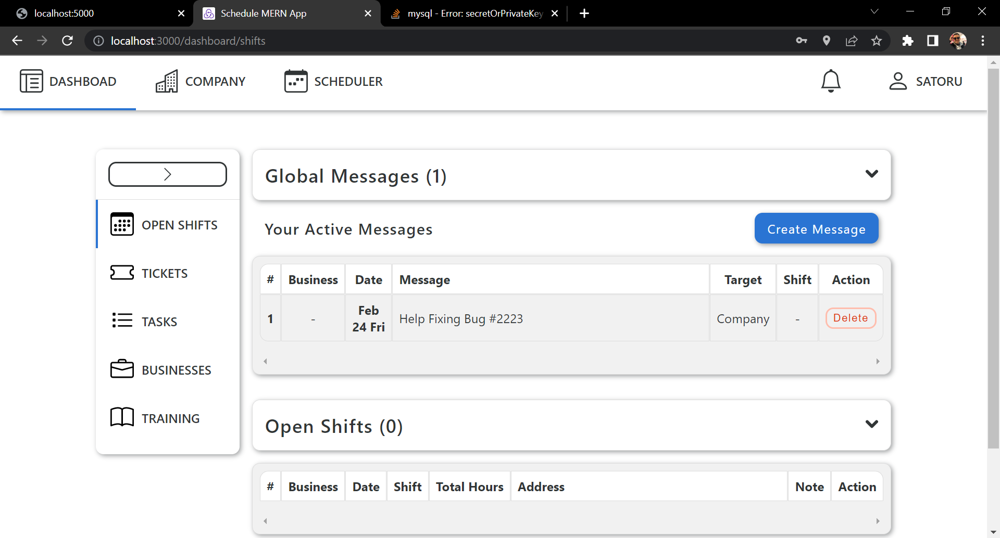

# mern-scheduling-app
This app is meant for HR or Teams who want to organise their tasks better with much more flexibility where they can manage them, and notify everyone that's concerned.
Requirements: <br/>
React.js / MongoDB <br/>
First add a .env with the following line : <br/>
    JWT_KEY=secret <br/>
 # Then to run the App : <br/>
Start by running the server/Backend : <br/>
- ```npm install``` <br/>
- ```npm start``` <br/>
Then the frontend App : <br/>
- ```cd frontend npm install``` <br/>
- ```npm start``` <br/>
 # Here are some Screenshots of the App : <br/>
 - Login and Register page : <br/>
 <br/>
 <br/>
 - Dashboard : <br/>
The user can controle everythign through the dashboard and manage Tasks, schedule them, write notes/stickers and notify other employees. <br/>
 <br/>
 <br/>
 - Profile : <br/>
The user here can modify his informations and the company's along with the relations between the employees and other businesses <br/>
<br/>
<br/>
 - The Schedule : <br/>
Here we can view every employee with every single tasks with the time and dates: <br/>
<br/>


